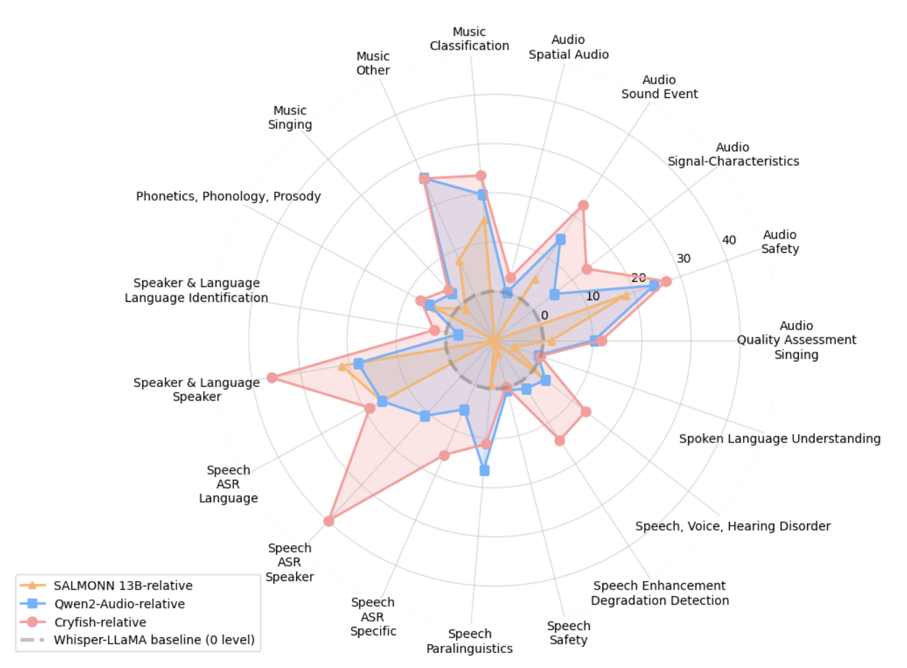

<div align="center">
    <h1>
    CryFish 
    </h1>
    <p>
    Official PyTorch code and supplementary materials for CryFish Audio LLM 
    </p>
    </p>
    <a href=""></a>
    <a href="https://huggingface.co/theio/CryFish"></a>
    <a href="https://www.apache.org/licenses/LICENSE-2.0"></a>
</div>


<div align="center">

</div>

## Running training and inference

### Inference
We're providing a basic example for inference with predefined path for audio in `cryfish/inference.py`


You need to pass path for predownloaded `wavlm-large`, `Qwen2.5-7b-instruct` and `cryfish.safetensors` with [model weights](https://https://huggingface.co/theio/CryFish). \


```bash
python -m cryfish.inference "path/to/wavlm-large" "path/to/Qwen2.5-7B-Instruct" --ckpt "/path/to/cryfish.safetensors"

```
Safetensors file contains LoRA for LLM, connector weights, and finetuned weights for wavlm. We're not made a separate LoRA adapter due to LoRA having `lm_head` module, that breaks exporting an the adapter ends up way bigger than the checkpoint with all weights. 

### Training
Basic example of running training can be found in `cryfish/train.py`\\
```bash
python -m cryfish.train \
  "/path/to/experiments/run1" \
  "/path/to/wavlm-large" \
  "/path/to/Qwen2.5-7B-Instruct" \
  "/path/to/prev_checkpoint.safetensors" \
  "/path/to/train_annotations.json" \
  "/path/to/val_annotations.json"
```

`data_preparation/data_train_example.json` + `data_preparation/readme.md` - there's small example of how the data should look like and what keys are expected. 


There is also a small script for merging ckpts, our code does not save weights which are not being trained, so if you will finetune model without unfreezing wavlm, then afterwards you'll have to merge wavlm weights into ckpt or safetensors, 
otherwise final ckpt will not have finetuned WavLM
```bash
python -m cryfish.pl_module.utils_ckpt ckpt_1.ckpt ckpt_2.ckpt out.safetensors
```

## FAQ

### Why CryFish?

One of the earliest checkpoints on question about audio events answered "I can hear fishes crying", so that stick as a working name for the model.
